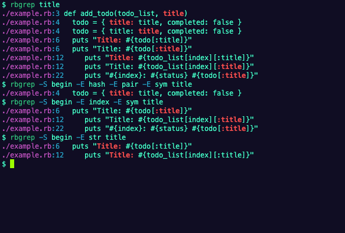

# rbgrep


[](LICENSE)

rbgrep is a AST-based line-oriented search cli tool that recursively searches **ruby files** in the current directory for a regex patterns.

### Screenshot of search results



## Install

```bash
cargo install --git https://github.com/harehare/rbgrep.git
```

### Manually

```
git clone https://github.com/harehare/rbgrep.git
cd rbgrep
cargo run
```

## Usage

```bash
Usage: rbgrep [OPTIONS] <QUERY> [STDIN]

Arguments:
  <QUERY>
  [STDIN]

Options:
  -c, --count
          Only print the count of individual matches for each file
  -i, --ignore-case
          Case insensitive search
  -m, --exact-match
          Exact match Search
  -., --hidden
          Search hidden files and directory
  -e, --regexp
          Regex pattern search
      --exclude <EXCLUDE>
          If specified, it excludes files or directories matching the given filename pattern from the search
  -S, --start-pattern <START_PATTERN>
          AST start pattern to match [possible values: alias, and, and-asgn, arg, args, array, array-pattern, array-pattern-with-tail, back-ref, begin, block, block-pass, blockarg, break, c-send, case, case-match, casgn, cbase, class, complex, const, const-pa
  -E, --end-pattern <END_PATTERN>
          AST end pattern to match [possible values: alias, and, and-asgn, arg, args, array, array-pattern, array-pattern-with-tail, back-ref, begin, block, block-pass, blockarg, break, c-send, case, case-match, casgn, cbase, class, complex, const, const-patt
  -P, --pattern <PATTERN>
          AST pattern to match [possible values: alias, and, and-asgn, arg, args, array, array-pattern, array-pattern-with-tail, back-ref, begin, block, block-pass, blockarg, break, c-send, case, case-match, casgn, cbase, class, complex, const, const-pattern,
      --no-git-ignore
          Don't respect .gitignore files
  -N, --no-file-name
          Never print the file path with the matched lines
      --no-line-no
          Never print the line number with the matched lines
      --no-color
          Not colored the output results
  -o, --only-matching
          Print only matched parts of a line
  -C, --context <CONTEXT>
          Show lines before and after each match
  -A, --after-context <AFTER_CONTEXT>
          Show lines before each match
  -B, --before-context <BEFORE_CONTEXT>
          Show lines before each match
      --context-separator <CONTEXT_SEPARATOR>
          The string used to separate
      --with-nodes
          Print nodes with the matched lines
      --with-warning
          Print warning after parse of ruby file
      --threads <THREADS>
          Number of grep worker threads to use
      --max-depth <MAX_DEPTH>
          The maximum depth to recurse
  -j, --json
          Show search results in a JSON format
  -q, --quiet
          Do not output matched lines. instead, exit with status 0 when there is a match and with non-zero status when there isn’t
  -p, --path <PATH>
          Searches for specified files and directories
  -h, --help
          Print help
  -V, --version
          Print version
```

## Command line usage example

### Example

```rb
$ rbgrep -S begin -E hash -E pair -E sym title
./example.rb:7     article = {title: title, content: content, published_on: Time.now}
```

```rb
$ rbgrep -S begin -E index -E sym title
./example.rb:14       puts "Title: #{article[:title]}"
```

```rb
$ cat example.rb | rbgrep -S begin -E index -E sym title -
:14       puts "Title: #{article[:title]}"
```

```rb
$ rbgrep -S begin -E index -E sym -p example.rb -p example2.rb title
:14       puts "Title: #{article[:title]}"
```

## License

[MIT](http://opensource.org/licenses/MIT)
